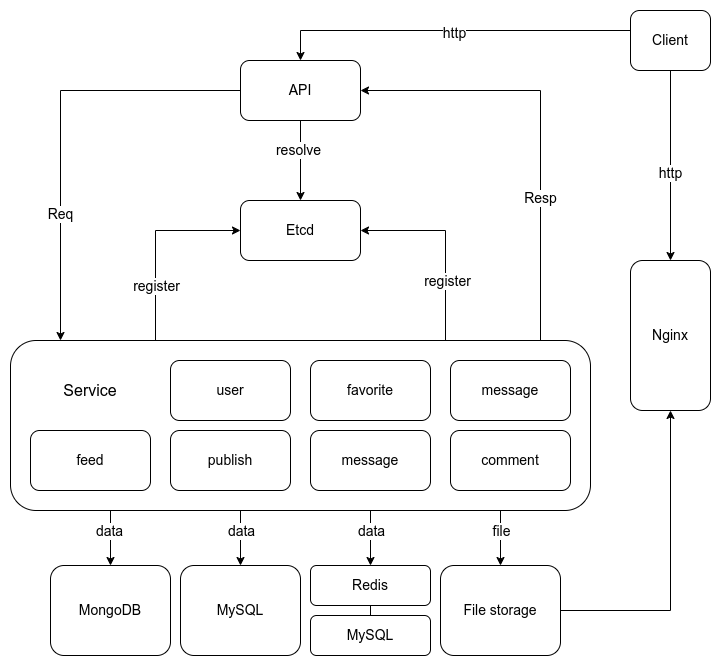

# Mini-Tiktok 极简版抖音

<div align=left>


</div>


## 一、基本介绍
### 1.1 项目介绍
**mini-tiktok**是一个基于微服务框架[Kitex](https://www.cloudwego.io/docs/kitex/)和HTTP框架[Hertz](https://www.cloudwego.io/docs/hertz/)开发的极简抖音后端项目; 您可以在[极简抖音App使用说明 - 青训营版](https://bytedance.feishu.cn/docs/doccnM9KkBAdyDhg8qaeGlIz7S7)中获取安卓APP下载链接; 所有接口及说明文档请参考[极简版抖音接口说明文档](https://apifox.com/apidoc/shared-09d88f32-0b6c-4157-9d07-a36d32d7a75c)；

**本项目来自第五届[字节跳动青训营](https://youthcamp.bytedance.com/)后端专场，感谢字节跳动提供的技术学习和交流平台**

### 1.2 技术栈

- 本项目使用Go语言开发，采用了字节跳动开源的微服务RPC框架[Kitex](https://www.cloudwego.io/docs/kitex/)和HTTP框架[Hertz](https://www.cloudwego.io/docs/hertz/)；
- 本项目使用[MySQL](https://www.mysql.com/)、[Redis](https://redis.io/)以及[MongoDB](https://www.mongodb.com/)作为数据库支持，并且使用[ETCD](https://etcd.io/)实现微服务的发现与注册；
- 此外本项目还使用到了viper、gorm、jaeger等第三方库以及使用[nginx](http://nginx.org/en/index.html)提供文件访问服务。

### 1.3 项目结构
本项目将需求拆分为七个RPC服务、一个http的api接口以及一个静态资源访问的接口：

| Service Name | Usage               | Framework   | protocol | Path         | IDL                 |
|--------------|---------------------|-------------|----------|--------------|---------------------|
| api          | 服务api的http接口        | kitex/hertz | http     | cmd/api      | -                   |
| file-system  | 视频、封面等静态资源访问的http接口 | nginx       | http     | -            | -                   |
| feed         | 视频流推送的逻辑处理          | kitex/gorm  | thrift   | cmd/feed     | idl/feed.thrift     |
| publish      | 视频上传的逻辑处理           | kitex/gorm  | thrift   | cmd/publish  | idl/publish.thrift  |
| comment      | 视频评论的逻辑处理           | kitex/gorm  | thrift   | cmd/comment  | idl/comment.thrift  |
| favorite     | 视频点赞的逻辑处理           | kitex/gorm  | thrift   | cmd/favorite | idl/favorite.thrift |
| user         | 用户数据的逻辑处理           | kitex/gorm  | thrift   | cmd/user     | idl/user.thrift     |
| relation     | 用户关注的逻辑处理           | kitex/gorm  | thrift   | cmd/relation | idl/relation.thrift |
| message      | 用户聊天的逻辑处理           | kitex/gorm  | thrift   | cmd/message  | idl/message.thrift  |

项目整体架构：



项目文件结构：
```
├── cmd: 
│    ├── api: API访问接口
│    ├── comment：评论发布和查询相关微服务
│    ├── favorite：视频点赞及列表相关微服务
│    ├── feed：视频流推送微服务
│    ├── message：用户聊天微服务
│    ├── publish：视频发布及列表查询相关微服务
│    ├── relation：关注、粉丝和朋友相关功能微服务
│    └── user：用户登录、注册、查询相关功能微服务
├── config: 配置信息结构, 对应yaml配置文件
├── idl: 接口描述文件
│    ├── comment.thrift：评论相关
│    ├── favorite.thrift：点赞相关
│    ├── feed.thrift：视频推送
│    ├── message.thrift：聊天相关
│    ├── publish.thrift：视频发布相关
│    ├── relation.thrift：关注相关
│    └── user.thrift：用户相关
├── kitex_gen: 由kitex代码生成工具生成
├── model: 数据实体
└── pkg: 工具和组件
```

## 二、项目启动

### 1. 环境准备
本项目在`Ubuntu 22.04 LTS`下进行开发和测试，Windows用户推荐使用WSL2编译运行，并且准备好以下环境：
- 请保证`Go编译器`版本为`1.9.x`，以确保代码能够正常编译运行；
- 需要`MySQL8.0`及以上版本，并且提前创建好一个数据库，字符集为`utf8mb4`；
- 本项目使用的`MongoDB`版本为`v6.0.6`，确保使用支持内存缓存和磁盘缓存的版本以达到最好的运行效果；
- 尽量使用最新版`Redis`作为缓存数据库；
- 搭建`Nginx`服务器映射视频文件上传目录，配置文件可参考以下代码：
    ```
    server {
        listen 8081; # 端口
        server_name localhost; # 服务名
        charset utf-8; # 避免中文乱码
        root /data; # 显示的根索引目录，即文件上传目录
    
        location / {
            autoindex on;             # 开启索引功能
            autoindex_exact_size off; # 关闭计算文件确切大小（单位bytes），只显示大概大小（单位kb、mb、gb）
            autoindex_localtime on;   # 显示本机时间而非 GMT 时间
        }
    }
    ```
- 安装`ffmpeg`，用于截取视频封面；
- 搭建`etcd`服务，用于服务的注册与发现。

### 2. 编译和运行
以`cmd/user`为例，1）进入目录 2）编译 3）运行（请根据`config_template.yaml`填写配置信息，并且将其重命名为`config.yaml`后运行）：
```shell
cd cmd/user
sh build.sh 
sh output/bootstrap.sh
```
